# Cloud Operations Transfer — Azure, Databricks & AWS Training Notes

---

## Table of Contents

1. [Databricks Generative AI Fundamentals](#1-databricks-generative-ai-fundamentals)
2. [Lakehouse Architecture Fundamentals](#2-lakehouse-architecture-fundamentals)
3. [AWS Introduction to Generative AI](#3-aws-introduction-to-generative-ai)
4. [AWS Machine Learning Foundations](#4-aws-machine-learning-foundations)
5. [Amazon EC2](#5-amazon-ec2)
6. [AWS Messaging & Application Architecture](#6-aws-messaging--application-architecture)
7. [AWS Compute — Unmanaged, Managed & Serverless](#7-aws-compute--unmanaged-managed--serverless)
8. [Containers & Orchestration on AWS](#8-containers--orchestration-on-aws)
9. [Specific-Purpose AWS Compute Services](#9-specific-purpose-aws-compute-services)
10. [AWS Global Infrastructure](#10-aws-global-infrastructure)
11. [Amazon VPC & Networking](#11-amazon-vpc--networking)
12. [AWS Network Security](#12-aws-network-security)
13. [DNS, CDN & Edge Networking](#13-dns-cdn--edge-networking)
14. [Global Network Architectures](#14-global-network-architectures)
15. [AWS Storage](#15-aws-storage)
16. [Research Links](#16-research-links)
17. [Ideas](#17-ideas)

---

## 1. Databricks Generative AI Fundamentals

- Your data differentiates you from your competition — it is your competitive advantage.
- **First things to consider when deciding to use LLMs:**
  - **Model choice:** Open-source (fine-tune yourself) vs. proprietary (LLM-as-a-Service)?
  - **Privacy:** Data handling, storage, and deletion
  - **Quality:** How was the model trained? Accuracy, reliability, training dataset, and potential biases
  - **Cost:** Acquisition budget, additional infrastructure requirements, ongoing maintenance
  - **Latency:** Processing and response time, especially for time-sensitive applications

### Model Types

| Type | Description |
|------|-------------|
| **Proprietary (LLM-as-a-Service)** | Faster development, high quality (trained on extensive data). Downsides: expensive, data privacy risk, vendor lock-in |
| **Open-source Models** | More control, customizable |
| **Pre-trained Models** | Trained on your own curated data from scratch |
| **Fine-tuned Models** | Further training of a pre-trained/foundation model on a specific dataset or task |

### Key Concepts

- **DBRX:** Open-source general-purpose LLM by Databricks — helps companies build custom LLMs using the Databricks Intelligence Platform
- **LangChain:** Tool that chains calls to multiple LLMs at different pipeline stages. A vector database is required to store intermediate chain states.
- **RAG (Retrieval Augmented Generation):** Instead of fully fine-tuning a model, retrieve the most relevant data at run-time to improve accuracy.

### Databricks Data Intelligence Platform — AI Capabilities

- Create or fine-tune new or existing models
- Ensures data privacy and control
- Easy push to production
- Complete AI workflow (MLOps: deploying and managing models in production)
- AutoML: identify optimized models quickly

### AI Governance Considerations

- **Regulatory policies to review:**
  - EU AI Act
  - US Algorithmic Accountability Act
  - Japan AI Regulation Approach
  - California Regulation of Automated Decision Tools
- **Bias Reinforcement Loop** in model training and fine-tuning is a known risk.

### Strategic Approach

- Identify goals and objectives for adopting AI
- Strategize what is feasible, needed, and doable
- Prioritize applicable use cases aligned with business goals

---

## 2. Lakehouse Architecture Fundamentals

### Databricks Workspace Overview

- **Hierarchy:** Catalog → Schemas (a.k.a. databases) → Tables, Views, Volumes, Models & Functions
- **Workspace:** Contains Repos & Shared Assets — Git folders, Files, Notebooks, etc.
- **Delta Sharing:** Open-source tool powering Databricks Marketplace
- **Databricks Marketplace:** Doesn't require Databricks to use, but is natively integrated into the Workspace

### Lakehouse Architecture Scope

- **Architectural Components**
- **Personas:** People/job functions using the Lakehouse for different purposes
- **Platform domains:** Use cases and tasks for actually using the Lakehouse

The Databricks Data Intelligence Platform extends and is built upon the Lakehouse Architecture.

### Databricks Data Intelligence Platform

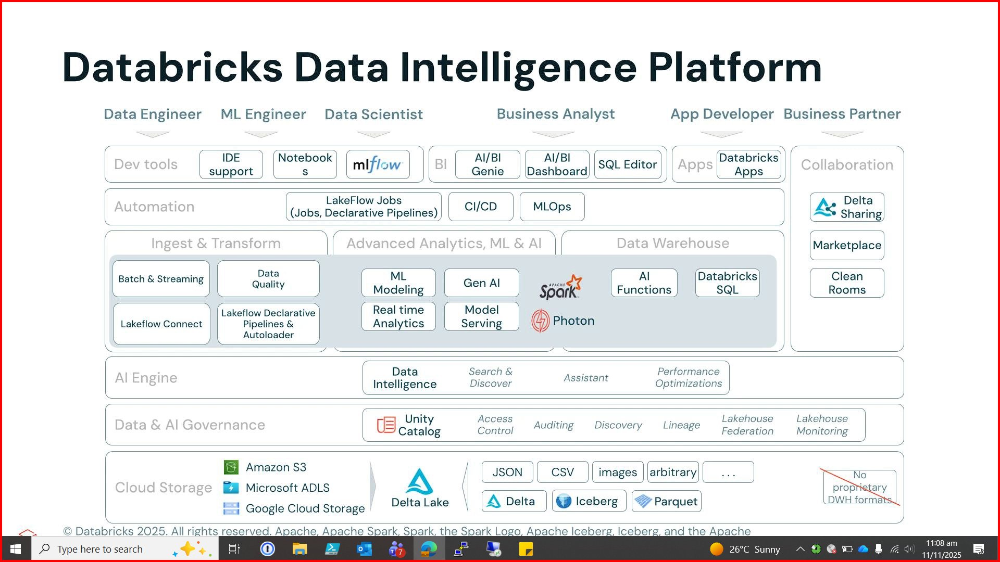

*Full platform overview showing all layers: Dev tools, Automation, Ingest & Transform, Advanced Analytics, Data Warehouse, AI Engine, Governance, and Cloud Storage.*

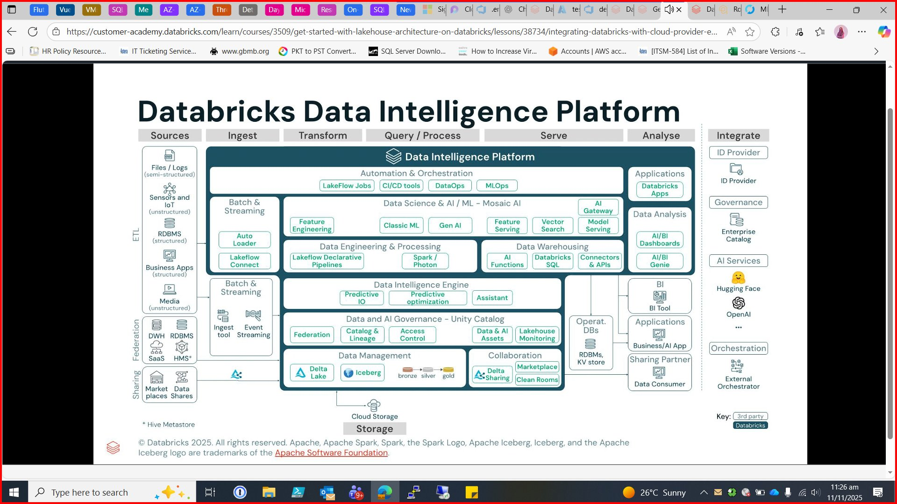

*Detailed view showing Sources → Ingest → Transform → Query/Process → Serve → Analyse pipeline with integration options.*

### Mosaic AI

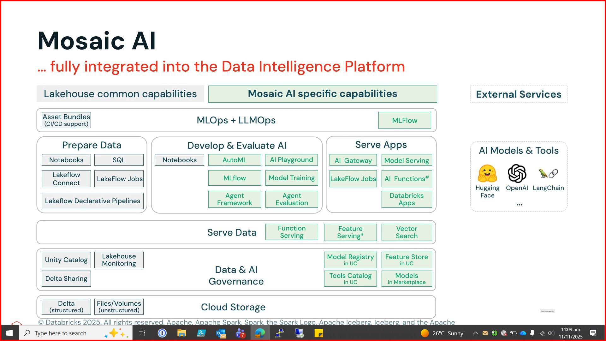

*Mosaic AI is fully integrated into the platform. Covers: Prepare Data (Notebooks, SQL, LakeFlow), Develop & Evaluate AI (AutoML, MLflow, Agent Framework/Evaluation), Serve Apps (AI Gateway, Model Serving, Databricks Apps), Serve Data (Function/Feature/Vector Search), and Data & AI Governance via Unity Catalog.*

### 6 Guiding Principles of Lakehouse Architecture

1. **Medallion Hub Architecture:** Bronze → Silver → Gold data layers for progressive data quality/trust
2. **Eliminate data silos:** Silos cause outdated, incorrect, or duplicated data
3. **Self-service access & lean management:** Democratize value creation through AI/BI Genie
4. **Organization-wide data governance:** Access controls, audit, lineage tracking
5. **Open interfaces & open formats:** Easy integration with other tools
6. **Build to scale:** Horizontal & vertical scaling; decouple storage and compute

### Cloud Provider Integrations

Databricks integrates with **Azure**, **AWS**, and **GCP**.

**Azure Architecture:**

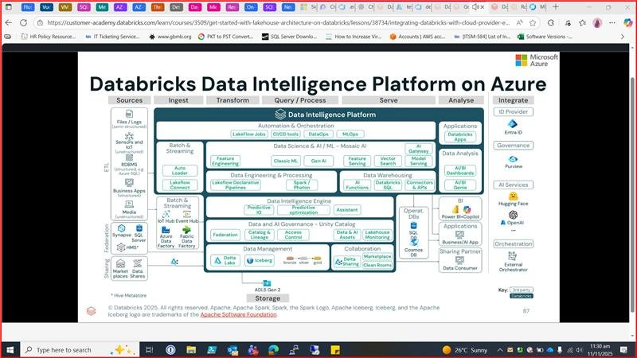

*Azure-specific diagram showing Synapse, Azure Data Factory, Azure SQL, IoT Hub/Event Hub as federation/streaming sources, with Entra ID, Purview, Power BI+Copilot, and Cosmos DB as integration services.*

**AWS Architecture:**

*AWS-specific diagram showing Amazon AppFlow, AWS DMS, AWS IoT Core/Kinesis, AWS Glue, Amazon Redshift as sources, with IAM Identity Center, Amazon QuickSight, Amazon Bedrock, Amazon RDS, Amazon DynamoDB as integration services.*

**GCP Architecture:**

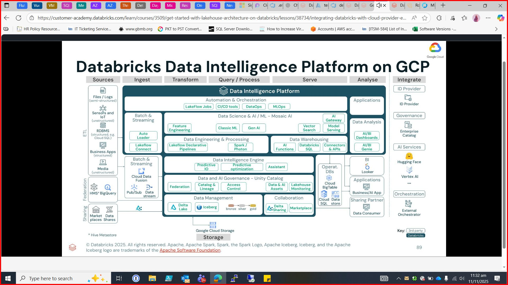

*GCP-specific diagram showing Cloud Data Fusion, Pub/Sub, Data stream, HMS/BigQuery as sources, with Looker, Vertex AI, Cloud BigTable, Cloud SQL, and Data store as integration services.*

### Well-Architected Lakehouse Pillars

1. Operational Excellence
2. Security, Privacy and Compliance
3. Reliability
4. Performance Efficiency
5. Cost Optimization
6. Data Governance *(Lakehouse-specific)*
7. Interoperability & Usability *(Lakehouse-specific)*

### Data Architecture Strategies

- **Standardize:** Using Unity Catalog & Delta Uniform
- **Prioritize:** Identify applicable platform use cases and align with business goals
- **Democratize:** Integrate AI with intent to scale as the business grows

---

## 3. AWS Introduction to Generative AI

### Traditional ML vs. Generative AI

| | Traditional ML | Generative AI |
|--|----------------|---------------|
| Training | Trained on exact data you provide | Pre-trained on massive general domain data |
| Tasks | Performs only one task | Can perform multiple tasks |

### Foundational Models

- A class of ML models pre-trained on vast data to perform a wide range of tasks
- Tasks include: text generation, information extraction, data summarization, Q&A, chatbot interactions

### Traditional ML Models vs. Foundation Models

| | Traditional ML | Foundation Models |
|--|----------------|-------------------|
| Data | Labeled data for each specific task | Unlabeled data for pre-training a single model |
| Architecture | Separate model per task | One model adapted per task |

### Types of Foundation Models

- **Text-to-text:** NLP tasks, Generative LLMs — takes input text and extends it. Developed by ML research community, startups, and established companies.
- **Text-to-embeddings:** Compares input text with indexed data (e.g. search results from a user prompt)
- **Multi-modal:** Understands and generates different formats (e.g. text + images). Example: Stable Diffusion.

### Data Augmentation

Generation of synthetic data to train ML models when the original dataset is small, imbalanced, or insufficient.

### Challenges in Using GenAI for Businesses

- Finding the best-suited foundation model for specific business needs
- Keeping data secure when fine-tuning — AWS Bedrock allows fine-tuning within the customer's own VPC
- **AI21 Labs** — *Research: What is this company?*

### AWS GenAI Services

| Service | Description |
|---------|-------------|
| **Amazon Bedrock** | Makes foundation models from Amazon and leading startups available via API |
| **Amazon Q Developer** | AI coding assistant |
| **AWS Inferentia** | Custom ML chip for high-performance inference; used with EC2 + AWS Neuron SDK |
| **AWS Trainium** | Deep Learning training accelerator for NLP, computer vision, recommendation models |
| **AWS SageMaker JumpStart** | Quick ML deployment with foundation models, CloudFormation templates, fine-tuning for 150+ open-source models |

---

## 4. AWS Machine Learning Foundations

### ML Career Paths

- Software Engineer / Software Programmer / Developer / Computer Engineer
- Data Scientist / ML Engineer / Applied Science Researcher / ML Developer

### AI Hierarchy

**Artificial Intelligence > Machine Learning > Deep Learning**

### ML Vocabulary

| Term | Definition |
|------|-----------|
| Model | — |
| Training Algorithm | — |
| Computer Vision | — |
| Artificial Neural Networks | — |
| Computer Model Instances | — |
| Inference | — |

> **Note:** Amazon EC2 = Amazon Elastic Compute Cloud

### Problems Solved by ML

- **Binary Classification:** Two-category output
- **Multi-class Classification:** More than two category outputs
- **Regression:** Numeric value output

### Classical Programming vs. ML Programming

| | Classical | ML |
|--|-----------|-----|
| Rules | Explicitly defined | Derived from data |
| Factors | Few/finite/known | Many/infinite/unknown |
| Scale | Small data | Large data |
| Output | Fixed logic | Patterns → model → predictions |

### ML Algorithms

- **Supervised Learning:** Uses labeled datasets
- **Unsupervised Learning:** Uses unlabeled datasets (e.g. Clustering)
- **Reinforcement Learning:** Trial and error to achieve an outcome where the path is unknown

### Key Terms

- **Features:** Columns in a dataset
- **Weights:** Likelihood of accuracy

### ML Pipeline

1. **Problem Formulation:** Convert business problem to ML problem
2. **Data Preparation & Pre-processing:** Raw data collection, formatting (Private vs. Commercial vs. Open-source data)
3. **Feature Engineering:** Feature extraction/transformation, selection, encoding, handling outliers, cleaning
4. **Model Selection**
5. **Model Training**
6. **Model Evaluation**
7. **Model Fine-tuning** (repeat from step 4)
8. **Business Goal Decision:**
   - If not met → Feature Augmentation or Data Augmentation
   - If met → Model Deployment

**Dataset Split:**
- Training data: ~80%
- Validation data: ~10%
- Testing data: ~10% *(actual accuracy-telling part)*

> Concepts to understand: **Overfitting, Underfitting, Balanced fitting**

### ML Stack Layers

| Layer | Description |
|-------|-------------|
| **Data Layer** | Stores data that feeds into model |
| **Model Layer** | Models + algorithms that build predictions |
| **Deployment & Monitoring Layer** | Model live in environment, producing ML tasks |

### Python ML Tools

| Tool | Description |
|------|-------------|
| **Jupyter Notebook / JupyterLab** | Open-source web app for live code, equations, visualizations |
| **Pandas** | Spreadsheet-like DataFrames |
| **Matplotlib** | Data visualization |
| **Seaborn** | Higher-level data visualization |
| **NumPy** | Fundamental computing package |
| **Scikit-learn** | Open-source ML library |

### ML Frameworks

PyTorch, TensorFlow, Keras, Caffe2, Gluon, CNTK, Torch, Chainer, Apache MXNet

### AWS Compute Instances for ML

| Instance | Use Case |
|----------|----------|
| **EC2 C5/C5n** | Compute-intensive workloads, ML/DL inference |
| **EC2 P3** | Fastest for ML training, massive parallel processing |
| **AWS IoT Greengrass** | ML at edge devices |
| **Amazon Elastic Inference** | Low-cost GPU acceleration for EC2/SageMaker/ECS; reduces inference costs by up to 75% |

### AWS Managed ML Services (No ML Experience Required)

| Category | Service | Description |
|----------|---------|-------------|
| Computer Vision | Amazon Rekognition | Object and facial recognition (image + video) |
| Computer Vision | Amazon Textract | Extract text from images |
| Chat | Amazon Lex | Build conversational voice/text apps |
| Speech | Amazon Polly | Text-to-speech |
| Speech | Amazon Transcribe | Speech-to-text |
| Language | Amazon Comprehend | NLP insights and relationships in text |
| Language | Amazon Translate | Multilingual translation |
| Fraud | Amazon Fraud Detector | Identify fraudulent activities |
| Recommendations | Amazon Personalize | Individualized recommendations |

### AWS SageMaker

- Full ML pipeline support: build, train, deploy
- **SageMaker Notebooks:** Fully managed Jupyter Notebooks + VMs
- **Instance Families:**
  - `t` family — ideal for notebooks
  - `m`, `r`, `c` — standard, memory, compute
  - `p` family — accelerated compute, ideal for traditional ML training
  - `g` family — accelerated inference, smaller DL training jobs
  - Elastic inference — ideal for inference
- Provides automatic hyperparameter tuning & optimization
- AWS Marketplace integration

**SageMaker Tutorial Flow:**
Select "Create Notebook" → Choose instance type → Create/use IAM role → Open Jupyter Notebook → Select kernel → Toggle between code and markdown

---

## 5. Amazon EC2

### Overview

- **Multi-tenancy:** Multiple VMs share resources on the same physical host with isolation
- Launch requires: **AMI** (OS + software) + **Instance Type** (hardware specs)
- **Connection methods:** Network, SSH (Linux), RDP (Windows), AWS Systems Manager

### Instance Families

| Family | Best For |
|--------|----------|
| General Purpose | Diverse workloads, web services, code repos |
| Compute Optimized | Gaming servers, HPC, ML tasks, scientific modeling |
| Memory Optimized | Large in-memory datasets |
| Accelerated Computing | Float calculations, GPU, data pattern matching |
| Storage Optimized | High-performance locally stored data |

### EC2 Pricing Options

| Option | Description |
|--------|-------------|
| **On-Demand** | Pay per hour/second, no commitments |
| **Savings Plans** | Commit to $/hr over 1 or 3 years; up to 72% savings. Applies to EC2, Fargate, Lambda, SageMaker |
| **Reserved Instances** | 1 or 3-year commitment; up to 75% discount. Payment: All upfront / Partial / None |
| **Spot Instances** | Up to 90% off On-Demand; AWS can reclaim with 2-min warning |
| **Dedicated Hosts** | Physical server reserved exclusively; ideal for compliance/licensing |
| **Dedicated Instances** | Physical isolation without choosing the specific server |
| **Capacity Reservations** | Reserve capacity in a specific AZ; charged at On-Demand rate |

### Scalability vs. Elasticity

- **Scalability:** Long-term capacity planning to grow over time
  - Scale up = vertical scaling
  - Scale out = horizontal scaling
- **Elasticity:** Automatic, real-time resource adjustment based on demand

### EC2 Auto Scaling

- **Dynamic scaling:** Adjusts in real-time to demand fluctuations
- **Predictive scaling:** Pre-schedules instances based on anticipated demand
- **Auto Scaling Group settings:**
  - **Minimum capacity:** Floor — never scales below this
  - **Desired capacity:** Target — defaults to minimum if unspecified
  - **Maximum capacity:** Ceiling — prevents over-scaling

### Elastic Load Balancing (ELB)

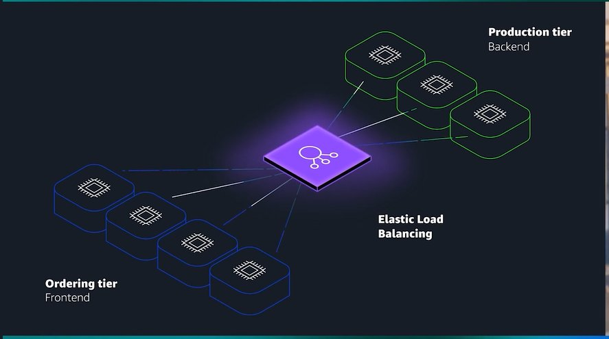

*ELB sits between the frontend ordering tier and backend production tier, distributing traffic across multiple EC2 instances.*

- Distributes incoming traffic across EC2 instances
- Serves as single entry point for Auto Scaling groups
- Scales automatically without increasing hourly costs

**ELB Routing Methods:**

| Method | Description |
|--------|-------------|
| Round Robin | Cycles traffic evenly across all servers |
| Least Connections | Routes to server with fewest active connections |
| IP Hash | Routes same client IP to same server |
| Least Response Time | Routes to server with fastest response |

**ELB + Auto Scaling together:** ELB distributes traffic; Auto Scaling adjusts instance count. Together they maintain reliability and cost efficiency.

---

## 6. AWS Messaging & Application Architecture

### Monolithic vs. Microservices

- **Monolithic:** Tightly coupled components — one failure can bring down the whole app
- **Microservices:** Loosely coupled — one failure doesn't disrupt the rest

### AWS Messaging Services

| Service | Type | Description |
|---------|------|-------------|
| **Amazon EventBridge** | Event bus | Routes events from sources to destinations; serverless; handles high event volumes; stores events if target is unavailable |
| **Amazon SQS** | Message queue | Send, store, receive messages at any scale; payload sits in queue until processed and deleted |
| **Amazon SNS** | Pub/Sub | Publishers send to SNS topics; subscribers (web servers, email, Lambda, etc.) receive immediately; supports fan-out via mobile push, SMS, email |

**Key difference — SQS vs SNS:**
- SQS: Messages held in queue until consumer retrieves them (async)
- SNS: Messages need a response right away; not held for pickup

---

## 7. AWS Compute — Unmanaged, Managed & Serverless

### Service Responsibility Model

| Type | AWS Manages | You Manage |
|------|-------------|-----------|
| **Unmanaged (e.g. EC2)** | Physical hardware | OS, security, network, apps |
| **Managed** | Infrastructure, hardware | Deployment options, scaling, environment |
| **Fully Managed / Serverless (e.g. Lambda)** | Everything — infrastructure, scaling, availability | Application code security |

### AWS Lambda

- **Serverless compute** (Function as a Service)
- No servers to manage; automatically scalable and highly available
- Maximum function duration: **15 minutes**
- Supports Java, Python, Node.js + custom runtimes via runtime layers
- Charged only for compute time consumed, down to the millisecond; price depends on memory allocated
- Integrates easily with other AWS services

**Lambda Flow:**
1. Upload code as a Lambda function
2. Configure trigger (AWS services, mobile apps, HTTP requests)
3. Code runs only when triggered
4. Pay only for compute time used

**Key components:** Function, Triggers, Runtimes

> Note: Although AWS manages infrastructure, you are responsible for correctly configuring IAM roles and permissions.

---

## 8. Containers & Orchestration on AWS

### Containers vs. VMs

- **Containers:** Package code + runtime + dependencies into a portable unit; share host OS; faster startup, lighter weight
- **VMs:** Use a hypervisor to run full, separate OS; less resource-efficient, longer startup

### Container Services

| Service | Role |
|---------|------|
| **Amazon ECR** | Store, manage, and deploy OCI-compliant container images |
| **Amazon ECS** | Scalable container orchestration; streamlined, AWS-integrated |
| **Amazon EKS** | Managed Kubernetes on AWS; more control, ideal for large-scale/hybrid |
| **AWS Fargate** | Serverless compute engine for containers; no server management |

### ECS Launch Types

- **ECS + EC2:** Full infrastructure control; custom hardware/networking
- **ECS + Fargate:** Serverless; no server management; teams focus on development

### EKS Launch Types

- **EKS + EC2:** Full infrastructure control; deep customization for complex large-scale workloads
- **EKS + Fargate:** Kubernetes flexibility without managing servers

> Fargate is a **container hosting platform**; ECS and EKS are **container orchestration services**.

---

## 9. Specific-Purpose AWS Compute Services

| Service | Description | Good For |
|---------|-------------|---------|
| **AWS Elastic Beanstalk** | Upload code; auto-provisions network, EC2, scaling, ELB | Web apps, RESTful APIs, microservices |
| **AWS Batch** | Fully managed batch computing; auto-scales EC2 fleet | Scientific computing, financial analysis, media transcoding, ML training |
| **Amazon Lightsail** | Simplified VPS, storage, DB, networking at fixed monthly price | Basic web apps, small business websites, dev/test, learning cloud |
| **AWS Outposts** | Extends AWS infrastructure to on-premises data centers | Low-latency apps, data residency requirements, hybrid cloud |

---

## 10. AWS Global Infrastructure

### Infrastructure Hierarchy

- **Regions:** Geographic areas; each has ≥3 Availability Zones
- **Availability Zones (AZs):** Isolated locations within a Region; each has 1+ data centers with independent power, networking, connectivity
- **Edge Locations:** Globally distributed sites for caching content (CloudFront, Route 53, Global Accelerator); separate from Regions

### Region Selection Criteria (in order)

1. **Compliance** — data residency laws, GDPR, government requirements
2. **Proximity** — minimize latency for users
3. **Feature Availability** — not all AWS services available in all Regions
4. **Pricing** — operational costs, tax laws vary by Region

### Key Properties

- **High Availability:** System operates continuously without failing
- **Agility:** Quickly adapt/deploy resources to changing requirements
- **Elasticity:** Auto-scale resources in response to real-time demand

### AWS CloudFormation (IaC)

- Define infrastructure in declarative text-based **CloudFormation templates**
- Specify *what* to build; CloudFormation handles *how*
- Deploy identical environments across multiple accounts/Regions
- Reduces human error; automates provisioning

**Ways to interact with AWS APIs:**

| Method | Best For |
|--------|---------|
| AWS Management Console | Beginners, graphical dashboards, visualizations |
| AWS CLI | Automate routine tasks via scripts |
| AWS SDKs | Integrate AWS services into applications |
| CloudFormation (IaC) | Complex infrastructure, DevOps CI/CD, multi-Region deployments |

---

## 11. Amazon VPC & Networking

### Amazon VPC Overview

- Provision an isolated section of AWS Cloud as a virtual network you define
- **Benefits:** Increased security (monitor connections, screen traffic, restrict access), full control over resource placement and security

### Key VPC Components

| Component | Description |
|-----------|-------------|
| **Internet Gateway** | Connects VPC to the public internet |
| **Virtual Private Gateway** | Entry point for VPN-encrypted traffic into VPC |
| **Subnets** | Segments of your VPC; each must have its own CIDR block and route table |
| **Public Subnet** | Internet-accessible (dashed box in diagrams); connected to Internet Gateway |
| **Private Subnet** | Isolated from public internet (solid box in diagrams) |
| **Route Table** | Contains routes that determine where network traffic is directed |
| **NAT Gateway** | Allows private subnet instances to reach the internet; blocks inbound external initiation |

### VPC Architecture Diagram

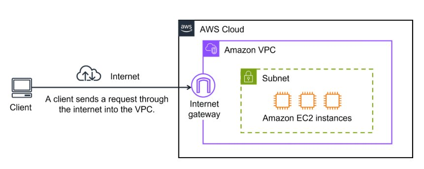

*Client → Internet → Internet Gateway → Amazon VPC → Subnet → EC2 instances*

### VPN & Virtual Private Gateway

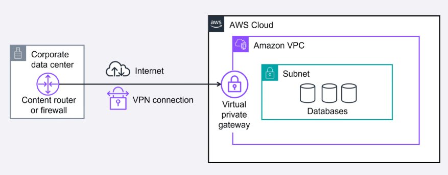

*Corporate data center → Content router/firewall → Internet + VPN connection → Virtual private gateway → Private subnet with databases inside VPC*

- **VPN:** Encrypted tunnel through the internet; shares internet bandwidth (prone to slowdowns with heavy payloads)
- **Virtual Private Gateway:** Entry point for VPN traffic into VPC; only allows approved network traffic

### Connectivity Services

| Service | Description | Use Case |
|---------|-------------|---------|
| **AWS Client VPN** | Fully managed, elastic VPN for remote workers; OpenVPN-based | Quickly scale remote-worker access |
| **AWS Site-to-Site VPN** | Secure encrypted connection between on-premises and AWS | Office-to-AWS connections, migrations, secure remote communication |
| **AWS PrivateLink** | Private VPC-to-service connection without internet gateway, NAT, or public IP | Connecting VPC clients to services/endpoints privately |
| **AWS Direct Connect** | Dedicated private connection between on-premises network and VPC | Large data transfers, latency-sensitive apps, hybrid cloud |
| **AWS Transit Gateway** | Central hub connecting VPCs and on-premises networks | Large-scale, multi-VPC connectivity |
| **Amazon API Gateway** | Create, publish, maintain, monitor, and secure APIs at any scale | Exposing backend services via APIs |

### AWS Direct Connect

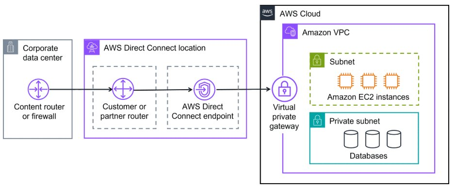

*Corporate data center → Content router/firewall → AWS Direct Connect location (Customer/partner router → Direct Connect endpoint) → Virtual private gateway → EC2 instances + Private subnet databases inside VPC*

- Bypasses the public internet entirely
- Reduces network costs; increases bandwidth
- Consistent, low-latency network experience
- Use cases: video streaming, large-scale data migration, hybrid cloud architectures

---

## 12. AWS Network Security

### Network ACLs vs. Security Groups

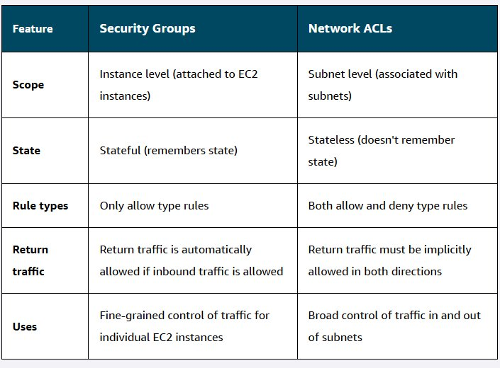

| Feature | Security Groups | Network ACLs |
|---------|----------------|--------------|
| **Scope** | Instance level (attached to EC2) | Subnet level |
| **State** | Stateful (remembers state) | Stateless (doesn't remember state) |
| **Rule Types** | Allow rules only | Allow and deny rules |
| **Return Traffic** | Automatically allowed if inbound is allowed | Must be explicitly allowed in both directions |
| **Uses** | Fine-grained control per EC2 instance | Broad control in/out of subnets |

### Network ACLs

- Virtual firewall controlling inbound/outbound traffic at **subnet level**
- Default ACL: allows all traffic in/out
- Custom ACLs: deny all until rules added; always includes explicit deny rule
- **Stateless:** Checks every packet both ways; no memory of previous requests

### Security Groups

- Virtual firewall for specific AWS resources (e.g. EC2 instances)
- Default: denies all inbound; allows all outbound
- **Stateful:** Remembers inbound decisions; return traffic automatically allowed
- Multiple EC2 instances in same VPC can share a security group

---

## 13. DNS, CDN & Edge Networking

### Amazon Route 53

- **DNS service** — translates domain names to IP addresses
- Can register domain names directly
- Manages DNS records for existing domain names
- Works with CloudFront for edge delivery

**Routing Policies:**

| Policy | Description |
|--------|-------------|
| Latency-based | Routes to Region with lowest latency |
| Geolocation | Routes based on customer's geographic location |
| Geoproximity | Routes based on proximity to resources |
| Weighted Round Robin | Distributes traffic based on assigned weights |

### Amazon CloudFront

- **CDN service** — delivers content with faster loading, cost savings, and reliability
- Stores copies of content at edge locations closer to users
- Serves websites, videos, images, and applications globally

### Edge Networking & Computing

- **Edge networking:** Brings storage and computing closer to data-producing devices and users
- **Edge computing:** Reduces latency by processing/caching data locally or near users

### AWS Global Accelerator

- Uses AWS private global network (bypasses congested public internet)
- Provides static IP addresses
- Intelligent traffic routing based on endpoint health, user location, and policies
- Fast failover if an application location fails
- Improves availability, performance, and security globally

---

## 14. Global Network Architectures

### Architecture Patterns

**VPN with Virtual Private Gateway**
- Secure encrypted connection over public internet
- Shares bandwidth; prone to slowdowns with heavy payloads
- Good for: remote access, small-scale data transfers, when dedicated line isn't needed

**Direct Connect with Virtual Private Gateway**
- Dedicated private line from on-premises to VPC
- Higher bandwidth; more consistent; more secure
- Good for: large data transfers, application performance, hybrid cloud

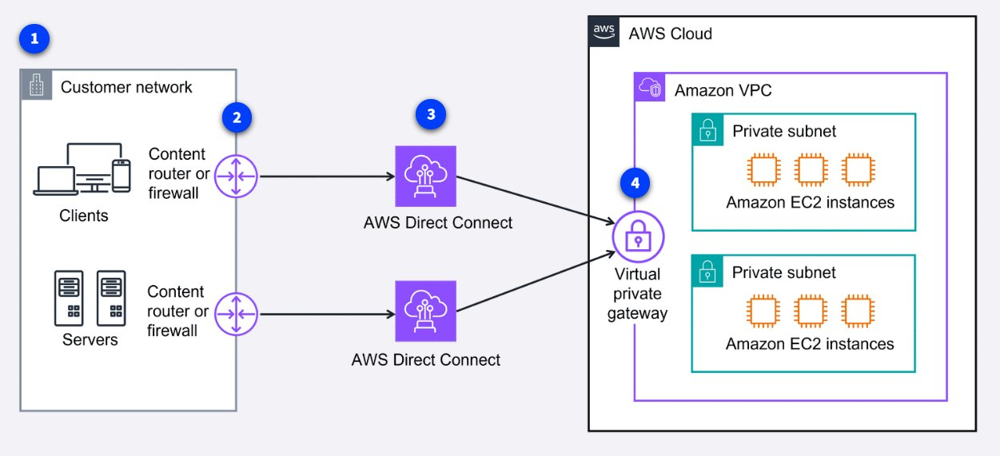

*Customer network (clients + servers) → Two content routers/firewalls → Two AWS Direct Connect connections → Virtual private gateway → Two private subnets with EC2 instances inside Amazon VPC*

**VPN as Direct Connect Failover**
- Direct Connect lines are physical — can be cut accidentally
- Use VPN as backup for failover when Direct Connect is unavailable

**Two Direct Connect Lines**
- Used for fault tolerance and/or increased aggregate bandwidth
- Combine multiple connections for higher throughput
- Clients access private VPC resources via virtual private gateway

**CloudFront + Route 53**

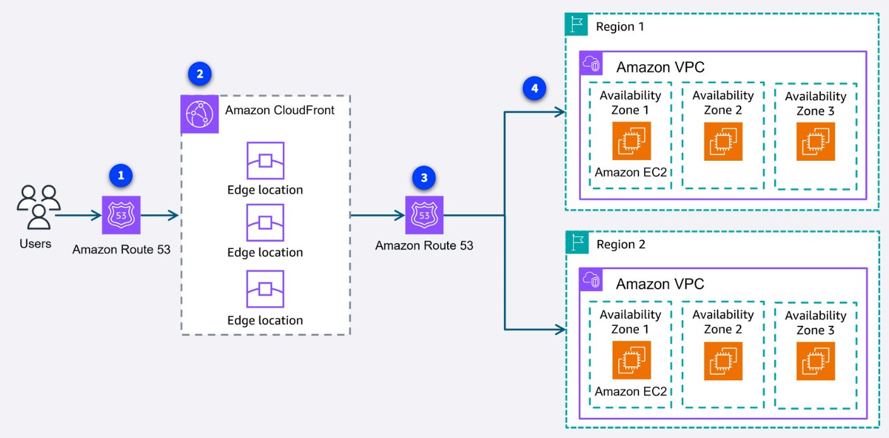

*Users → Route 53 (1) → CloudFront edge locations (2) → Route 53 again (3) → Routed to closest Region (Region 1 or 2, each with Amazon VPC across 3 AZs with EC2)*

- Route 53 uses latency-based routing to direct users to the closest Region
- CloudFront distributes content from edge locations globally
- Delivers seamless low-latency experience across multiple Regions

### Use Case Scenarios

| Scenario | Solution |
|----------|---------|
| Dedicated connection, consistent network, increased bandwidth | **AWS Direct Connect** |
| Secure encrypted connections across branch offices, cost-effective, no bandwidth increase needed | **AWS Site-to-Site VPN** |
| Quickly scale remote-worker access with advanced authentication | **AWS Client VPN** |
| Improve global app availability/performance with health-based traffic routing | **AWS Global Accelerator** |

---

## 15. AWS Storage

### Storage Types Overview

| Type | Description | Best For |
|------|-------------|---------|
| **Block Storage** | Data broken into blocks; fast, efficient; update blocks individually | Databases, apps needing frequent updates |
| **Object Storage** | Data stored as objects with metadata in flat buckets; whole object rewritten on change | Videos, backups, logs, static files |
| **File Storage** | Hierarchical file system; shared access over network | Content management systems, shared access apps |
| **Databases** | Organized information for querying, updating, and analyzing | Structured, relational/NoSQL data |

### Responsibility Model for Storage

| Model | AWS Manages | You Manage |
|-------|-------------|-----------|
| **Fully Managed** | Hardware, infrastructure, durability, availability, encryption, replication | Data management, access controls, configuration |
| **Managed** | Underlying infrastructure, hardware redundancy, volume replication | Backup strategies, encryption config, performance, capacity planning |
| **Unmanaged** | Physical hardware, network infrastructure | Everything else — data, backup, encryption, performance, durability |

### Amazon EC2 Instance Store

- **Non-persistent** block storage physically attached to EC2 host
- Extremely low latency, high I/O performance
- Data is **lost** when instance is stopped or terminated (ephemeral)
- Good for: temporary buffers, caches, scratch data
- **Not recommended** for data that needs to be retained

### Amazon Elastic Block Store (EBS)

- **Managed, persistent** block storage volumes attached to EC2 instances
- Independent from EC2 host — data survives stop/start/termination
- Performance measured in **IOPS** (input/output per second)
- Multiple volume types for different performance/pricing needs
- Automatically replicated within the same Availability Zone

**EBS Capabilities:**
- Attach/detach from instances; migrate between AZs via snapshots
- Modify volume type and size without downtime
- Encrypt volumes; back up with snapshots

**Use cases:** Database hosting, application backup, rapid environment cloning

### Amazon EBS Snapshots

- **Point-in-time backups** of EBS volumes stored in S3 (multi-AZ redundant)
- **Incremental:** First snapshot = full copy; subsequent = only changed blocks
- Each snapshot appears as a full point-in-time copy despite being incremental
- Deleting a snapshot only removes data unique to that snapshot
- Use cases: Disaster recovery, cross-Region migration, volume resizing, cloning, cross-account sharing

### Amazon Data Lifecycle Manager

- Automates EBS snapshot lifecycle management
- Schedule creation during off-peak hours
- Set retention policies; auto-delete outdated backups
- Apply tags, configure cross-Region copying, cross-account sharing

### Amazon S3

- **Fully managed, scalable object storage**
- Store any file type as **objects** in **buckets** (flat structure, not hierarchical)
- Maximum single object size: **5 TB**
- No maximum total bucket size — virtually unlimited storage

### Other AWS Storage Services

| Service | Type | Description |
|---------|------|-------------|
| **Amazon EFS** | File | Fully managed, scalable NFS file system for AWS Cloud + on-premises |
| **Amazon FSx** | File | Managed file storage for popular file systems (Windows, Lustre, NetApp ONTAP) |
| **AWS Storage Gateway** | Hybrid | On-premises access to virtually unlimited cloud storage |
| **AWS Elastic Disaster Recovery** | DR | Streamlines recovery of physical, virtual, and cloud servers into AWS |

---

## 16. Research Links

- **Amazon A2I (Augmented AI):** https://docs.aws.amazon.com/augmented-ai/
- **AWS ML Blog:** https://aws.amazon.com/blogs/machine-learning/
- **AWS ML Ramp-Up Guide:** https://d1.awsstatic.com/training-and-certification/ramp-up_guides/Ramp-Up_Guide_Machine_Learning.pdf

---

## 17. Ideas

### Auggie and the RAGroaches
A data augmentation-related company concept — play on the cartoon *Oggie and the Cockroaches*:
- *Auggie And The RAGroaches*
- *Auggie and the CockRAGches*

### AR Jewelry Color Analysis Tool
Instagram filter-type app for rings/watches/jewelry that performs color analysis to recommend the best jewelry/gemstone combinations for the user.
